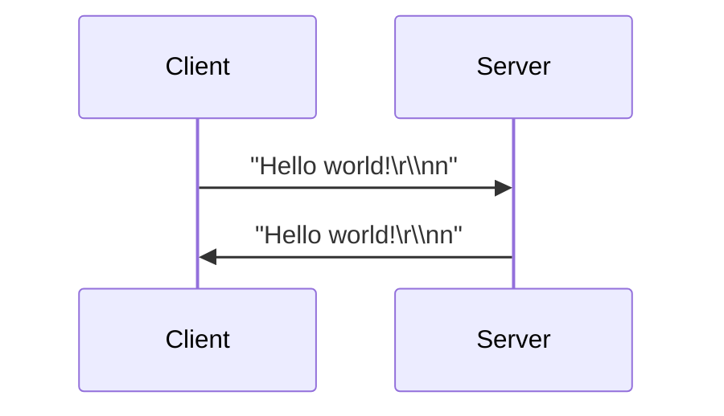
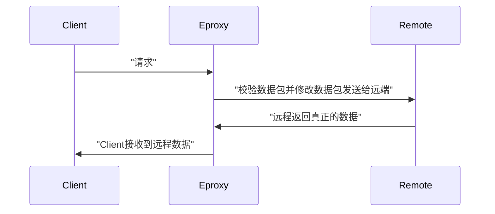
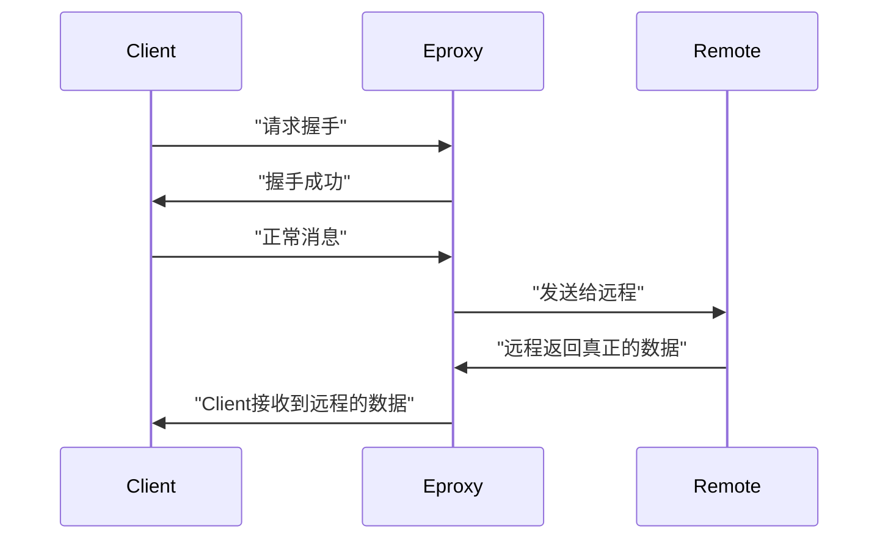
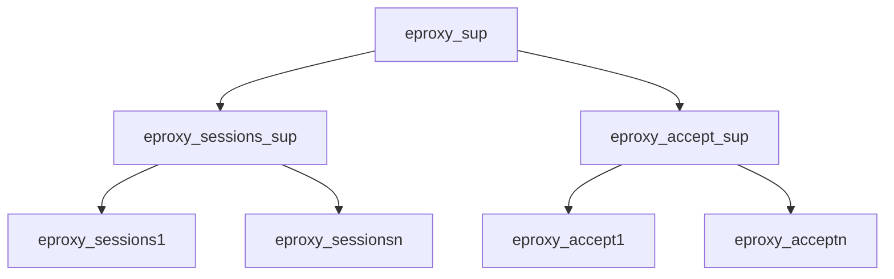
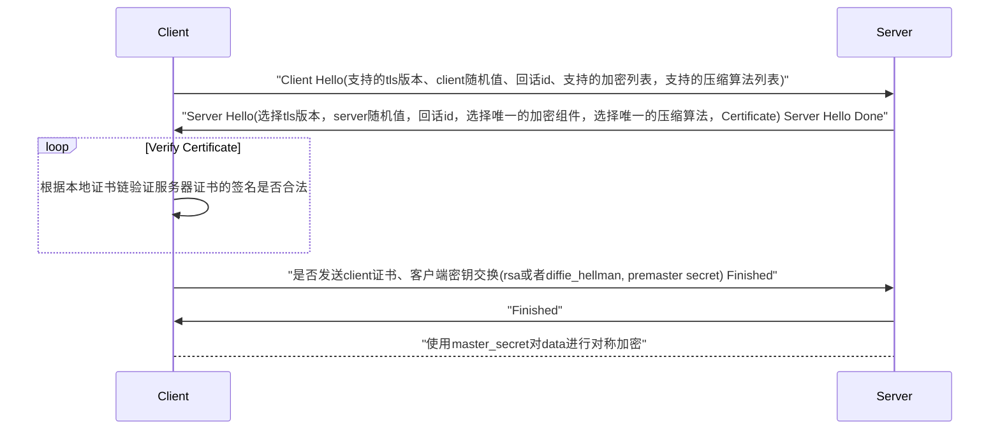
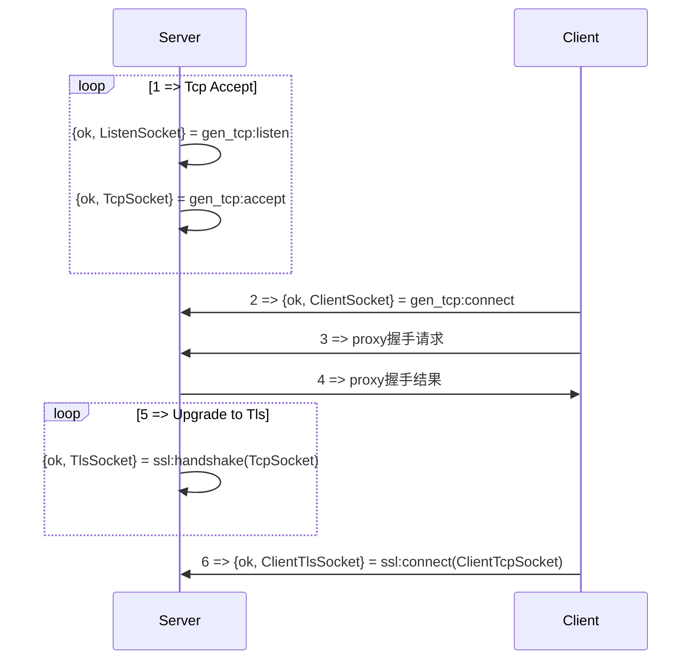

title: Erlang实战项目
speaker: 飓风
js:
    - https://echarts.cdn.apache.org/zh/asset/theme/infographic.js
plugins:
    - echarts: {theme: infographic}
    - mermaid: {theme: forest}
    - katex

<slide>

:::{.aligncenter}
# Erlang实战项目{.text-landing.text-shadow}
By 飓风 {.text-intro.animated.fadeInUp.delay-500}

[:fa-github: Github](https://github.com/yangcancai){.button.ghost}
:::
:::footer
[:fa-twitter: 飓风](){.alignright}
:::

:::header
!
:::

<slide>
:::{.aligncenter}
### 为什么使用Erlang语言
- 1.入门简单
- 2.开发效率高
- 3.质量高
- 4.热升级

:::

:::footer
<!-- [:fa-twitter: @username .alignright](){.alignright} -->
[:fa-github: 飓风](https://github.com/yangcancai){.button.ghost .alignright}
:::

:::header
!
:::

<slide class="size-60 aligncenter">

### Erlang可以做什么
- rabbitmq(消息队列中间件)
- riak(分布式no sql数据库)
- ejabberd/MongooseIM（IM聊天）
- whatsapp(IM聊天)
- arweave(区块链存储)

<slide class="size-60 aligncenter">

### 学习了这门课你会得到什么： 
- 自己可以独立开发、部署项目
- 按时完成工作，晚上可以睡个好觉 


<slide class="size-60 aligncenter">

## 1. 环境和工具安装
- Erlang版本是 26.0.2
- Elixir版本是1.15.4-otp-26
- rebar 3.18.0

```shell {.animated.fadeInUp}
# 安装包管理工具asdf https://asdf-vm.com/guide/getting-started.html
$ git clone https://github.com/asdf-vm/asdf.git ~/.asdf --branch v0.10.2

# 增加下面配置到 ~/.bashrc 或者~/.zshrc
$ . $HOME/.asdf/asdf.sh

# 增加erlang插件
$ asdf plugin add erlang

# 安装erlang对应的版本
$ asdf install erlang 26.0.2

# 当前目录指定对应对应版本erlang
$ asdf local erlang 26.0.2

# 验证erlang openssl是否安装成功
$ erl
Erlang/OTP 24 [erts-12.2.1] [source] [64-bit] [smp:8:8] [ds:8:8:10] [async-threads:1] [jit]

Eshell V12.2.1  (abort with ^G)
1> crypto:start().
ok
2>
```

<slide class="size-60 aligncenter">

### rebar3安装

```shell 
$ wget https://github.com/erlang/rebar3/releases/download/3.18.0/rebar3 
$ mv rebar3 ~/.asdf/shims/rebar3
```

<slide :class="size-60 aligncenter">

### 创建项目

---
```shell
## 下载项目模版  
$ cd ~/.config/rebar3
git clone  https://github.com/yangcancai/rebar3_template.git templates

## 创建release项目
$ rebar3 new release eproxy NAME=EPROXY 
$ cd eproxy && make
```

<slide :class="size-60">

# Eproxy(第1讲)
## 2. Eproxy项目
- 一个代理服务器
- 支持https抓包
- 支持websocket抓包

<slide>

### 2.1 第一步实现一个简单的echo
- 实现tcp版本的协议
- 编写测试用例验证



<slide>

# Eproxy(第2讲)

- http代理时序图协议
- http代理协议分析
- Erlang编码实现http代理服务器

<slide>

## 2.2 第二步支持http和https代理协议
### 2.2.1 http代理协议时序图



<slide class="fullscreen">

:::card


---

### 2.2.2 http请求协议
 请求\:
 GET <span style="color:yellow;"> http\://localhost\:80/</span> HTTP/1.1\r\n<br>
 Host\: localhost\:80\r\n<br>
 Proxy-Connection\: keep-alive\r\n<br>
 Proxy-Authorization\: Basic encoded-credentials\r\n<br>
 User-Agent\: curl 1.8\r\n<br>
 Accept\: text/html\r\n<br>
 Accept-Encoding\: gzip, deflate\r\n<br>
 Accept-Language\: zh-CN,zh;q=0.9,en-US;q=0.8,en;q=0.7\r\n\r\n<br>
发送给远端服务器\:<br>
 GET <span style="color:yellow">/</span> HTTP/1.1\r\n<br>
 Host\: localhost\:80\r\n<br>
 <s style="color:red;"> Proxy-Connection\: keep-alive\r\n</s><br>
 <s style="color:red;"> Proxy-Authorization\: Basic encoded-credentials\r\n</s><br>
 User-Agent\: curl 1.8\r\n<br>
 Accept\: text/html\r\n<br>
 Accept-Encoding\: gzip, deflate\r\n<br>
 Accept-Language\: zh-CN,zh;q=0.9,en-US;q=0.8,en;q=0.7\r\n\r\n<br>

:::

<slide class="fullscreen">

:::card 


---

# Eproxy(第3讲)

- https代理协议时序图
- 分析https代理协议
- Erlang实现一个https代理协议

:::

<slide>

## 3.1 https代理协议时序图



<slide class="fullscreen">

:::card


---

### 3.2 https代理协议
```erlang
请求握手:
    CONNECT localhost:443 HTTP/1.1\r\n
    Host: localhost:443\r\n
    Proxy-Connection: keep-alive\r\n
    Proxy-Authorization: Basic encoded-credentials\r\n
    User-Agent: Mozilla/5.0 (Linux; Android 10; HarmonyOS; AQM-AL00) AppleWebKit/537.36 (KHTML, like Gecko) Chrome/92.0.4515.105 Mobile Safari/537.36\r\n\r\n
握手成功:
   HTTP/1.1 200 OK\r\n\r\n
```
:::

<slide class="fullscreen">

:::card


---

# 4. Eproxy(第4讲)
- 设计supervisor
- 使用gen_server
- 增加日志系统

:::

<slide>

### 4.1 增加supervisor



<slide class="fullscreen">

:::card


---

# 5.Eproxy(第5讲)

- https(tls)原理
- 抓取https数据包的流程

:::

<slide>

## 5.1 https(tls)原理(RFC 2246)
- 交换hello消息对来协商算法，交换随机值，并检查会话恢复。
- 交换必要的加密参数，以允许客户端和服务器协商一个前置主secret。
- 交换证书和加密信息，以允许客户端和服务器对其进行身份验证。
- master_secret = PRF(pre_master_secret, "master secret",
ClientHello.random + ServerHello.random)



<slide>

## 5.2 抓取https数据包的流程

- a. 生成一个ca的密钥和根证书
- b. 根据ca的密钥和域名动态生成自签名的证书
- c. https代理协议握手成功后升级tcp协议为ssl协议
- d. 连接远端服务器使用ssl协议
- e. 对二进制数据流进行http协议解码

Warning: 把a生成的根证书导入到电脑信任的证书列表中


<slide class="fullscreen">

:::card


---

# 6.Eproxy(第6讲)

- tcp升级为tls握手部分
- 数据包解析部分 

:::

<slide>

## 6.1 tcp升级为tls握手部分

- 需要[ssl](https://www.erlang.org/doc/apps/ssl/using_ssl)依赖库




```erlang
{ok, TLSSocket} = ssl:handshake(TcpSocket, [
  {verify, verify_peer},
  {fail_if_no_peer_cert, true},
  {cacertfile, "cacerts.pem"},
  {certs_keys, 
  [#{certfile => "cert.pem", keyfile => "key.pem"}]}]).
  {ok,{sslsocket,[...]}}
```
